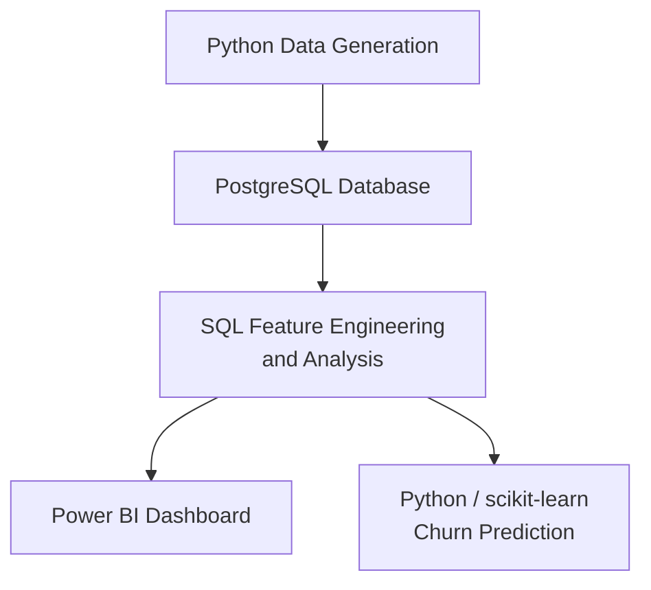
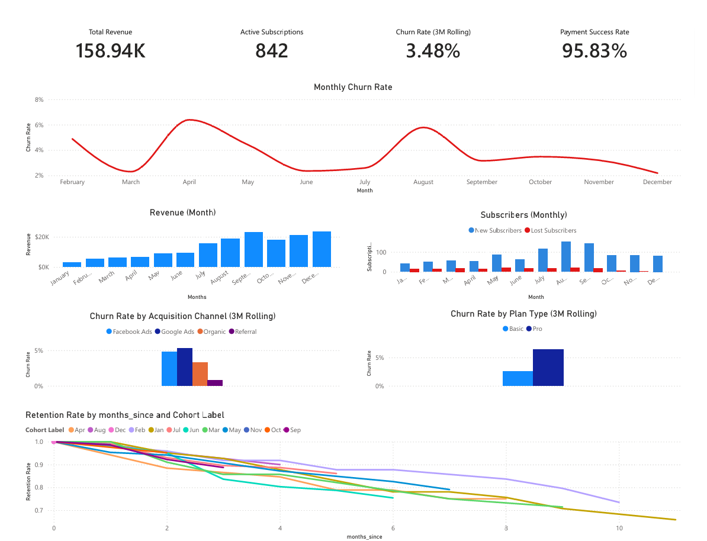
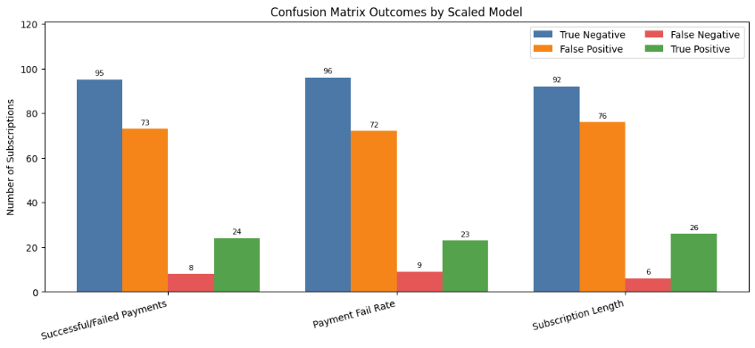
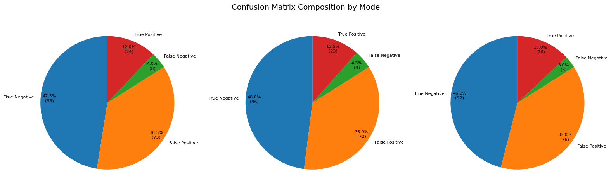

# Subscription Analytics & Churn Prediction Project

An end-to-end subscription analytics project built with PostgreSQL, Python, Power BI, and scikit-learn.

This project simulates a subscription-based business and analyses customer growth, revenue, churn, retention, payment performance, and churn prediction. The goal was to build a realistic analytics workflow that moves from data generation and SQL analysis through to dashboard reporting and machine learning.


## Project Overview

This project explores the key business questions faced by a subscription company:

- How is monthly revenue changing over time?
- Which subscription plans generate the most revenue?
- How many customers are churning?
- Which customer segments have higher churn?
- How well are customers retained over time?
- How successful are customer payments?
- Can customer churn be predicted using subscription and payment behaviour?

The project was developed as a full analytics pipeline:




## Key Features

- Synthetic subscription dataset generated with Python
- PostgreSQL database schema for customers, subscriptions, and payments
- SQL analysis covering revenue, churn, retention, payments, and LTV
- Power BI dashboard for business reporting
- Machine learning churn prediction notebook using logistic regression
- Feature engineering using payment failure rate and subscription length
- Investigation of multicollinearity and feature scaling
- Final model comparison and selection

## Tech Stack
<div align="center">

| **Area** | **Tools** |
|:---:|:---:|
| Database | PostgreSQL |
| Data Generation | Python |
| Data Analysis | SQL, pandas |
| Dashboarding | Power BI |
| Machine Learning | scikit-learn |
| Version Control | Git, GitHub |

</div>

## Repository Structure
```text
subscription-analytics-sql/
│
├── data_generation/
│   ├── data/
│   │   ├── customers.csv
│   │   ├── subscriptions.csv
│   │   └── payments.csv
│   └── data_generator.py
│
├── sql/
│   ├── schema.sql
│   ├── seed.sql
│   └── analysis/
│       ├── churn_metrics/
│       ├── growth_and_revenue/
│       ├── lifetime_value_and_unit_econ/
│       ├── payment_and_operational_metrics/
│       ├── retention_and_cohort_analysis/
│       └── subscriber_metrics/
│
├── powerbi/
│   ├── screenshots/
│   │   └── dashboard_overview.png
│   ├── Subscription Analytics Dashboard.pbix
│   ├── Subscription Analytics Dashboard.pdf
│   └── Subscription-analytics-project.pbit
│
├── machine_learning/
│   ├── ml_churn_prediction.ipynb
│   ├── churn_metric_isolation/
│   └── screenshots/
│
└── README.md
```

## Dashboard Preview

<p align="center">
  <b>Power BI Dashboard Overview</b><br>
  
</p>

## Machine Learning Extension

This project was extended with a churn prediction workflow using Python and scikit-learn.

The machine learning notebook investigates whether subscription and payment behaviour can be used to predict customer churn.

Notebook: [View the Churn Prediction Notebook](machine_learning/ml_churn_prediction.ipynb)

### Models Compared

Three logistic regression models were developed and compared:

<div align="center">

|**Model**|**Description**|
|:-:|:-:|
|Successful / Failed Payments Model|Uses raw successful and failed payment counts|
|Payment Failure Rate Model|Replaces raw payment counts with payment failure rate|
|Subscription Length Model|Adds customer tenure as an additional predictor|

</div>

<br>

<p align="center">
  <b>Scaled Model Confusion Matrix Comparison</b><br>
  
</p>
<p align="center">
  <b>Confusion Matrix Compositions by Model</b><br>
  
</p>


### Final Model

The **Subscription Length Model** was selected as the final model.

<div align="center">

|**Metric**|**Result**|
|:-|-:|
|Accuracy|59%|
|Precision|25%|
|Recall|81%|
|F1 Score|0.39|
</div>

The final model was selected because it achieved the highest recall and F1-score while incorporating customer tenure, an important behavioural signal for churn prediction.

Since churn prediction is primarily concerned with identifying at-risk customers, recall was treated as a particularly important metric.
The model prioritised recall over precision because, in a churn context, identifying more at-risk customers is often more valuable than avoiding every false positive.

### Machine Learning Concepts Demonstrated
- Logistic regression
- Train/test splitting
- Class imbalance handling
- Feature engineering
- Multicollinearity
- StandardScaler
- Coefficient interpretation
- Confusion matrix analysis
- Model comparison and selection

## Key Insights

#### **1. Billing Cycle was strongly associated with churn** 
Yearly subscribers were consistently associated with lower churn risk than monthly subscribers. This likely reflects both the structure of annual subscriptions and the assumptions embedded in the synthetic dataset.
<br>

#### **2. Payment feature design affected model interpretation**
Raw successful and failed payment counts were highly related to total payments. Replacing them with payment failure rate reduced redundancy and made the feature set easier to interpret.
<br>

#### **3. Payment success rate and payment failure rate were redundant**
Payment success rate and payment failure rate were found to contain the same information: 

<div align="center">
Payment Success Rate + Payment Failure Rate = 1
</div>

<br>

Because either feature can be calculated from the other, only one was needed.

#### **4. Feature scaling changed coefficient interpretation**
Before scaling, subscription length appeared to have little influence because it had a very small raw coefficient. After applying StandardScaler, subscription length emerged as one of the strongest predictors.
This demonstrated that raw logistic regression coefficients can be misleading when features operate on different numerical scales.
<br>

#### **5. Synthetic data has important limitations** 
Because the dataset was generated programmatically, some relationships may reflect assumptions in the data generation process rather than real customer behaviour. This was treated as a limitation throughout the analysis.

## SQL Analysis
The SQL analysis covers several major business areas:
<br>

#### Growth and Revenue
- Monthly recurring revenue
- Revenue by plan type
- Revenue by acquisition channel
- Revenue trends over time
<br>

#### Churn Metrics
- Overall churn rate
- Monthly churn rate
- Churn by plan type
- Churn by acquisition channel
- Early lifecycle churn
<br>

#### Retention and Cohort Analysis
- Monthly retention cohorts
- Retention by acquisition channel
- Retention by plan type
<br>

#### Payment Metrics
- Payment success rate
- Failed payments over time
- Revenue lost from failed payments
<br>

#### LTV and Unit Economics
- Average revenue per subscriber
- Estimated lifetime value by plan
- Customer revenue contribution

## Power BI Dashboard

The Power BI dashboard visualises the key subscription metrics produced from the SQL analysis.

Dashboard areas include:

- Revenue overview
- Monthly recurring revenue
- Churn trends
- Retention cohorts
- Payment performance
- Plan and acquisition channel comparisons

## How to Run This Project

These instructions assume you already have the following installed:

- PostgreSQL (version 13 or later recommended)
- pgAdmin
- Power BI Desktop (Windows only)
- Python (optional, only required if generating a new dataset)

### 1. Clone the Repository

Open Git Bash and navigate to the folder where you want to store the project, then run:
```bash
cd E:/your-folder-here
```

Use forward slashes `/` in file paths (e.g. `E:/Projects`)

Then in bash run: 
```bash
git clone https://github.com/Josh-Crankshaw/subscription-analytics-sql.git
cd subscription-analytics-sql
```


### 2. Generate Dataset (Optional)

If you want to generate a new dataset, in bash run:
```bash
python data_generation/data_generator.py --seed 42 --outdir data_generation/data
```

- Replace `42` with any integer between `0` and `4294967295`
- Using the same seed will always generate identical data
- The default dataset in this project was generated using seed `42`

### 3. Set Up PostgreSQL Database

#### Step 1: Create the Database

Open **pgAdmin**:

1. Right click **Databases**
2. Click **Create → Database**
3. Name the database:
subscription_analysis


4. Click **Save**


#### Step 2: Run Schema Script

1. Right click your new database
2. Select **Query Tool**
3. Press `Ctrl + O`
4. Open:
sql/schema.sql

5. Click **Execute**

This will create the required tables.


#### Step 3: Load Data into Tables
After running the schema, paste the following into the Query Tool:

```sql
COPY customers FROM 'FULL_PATH/data_generation/data/customers.csv' DELIMITER ',' CSV HEADER;
COPY subscriptions FROM 'FULL_PATH/data_generation/data/subscriptions.csv' DELIMITER ',' CSV HEADER;
COPY payments FROM 'FULL_PATH/data_generation/data/payments.csv' DELIMITER ',' CSV HEADER;
```

Replace `FULL_PATH` with your actual path.

Example:
```sql
COPY customers FROM 'E:/Projects/subscription-analytics-sql/data_generation/data/customers.csv' DELIMITER ',' CSV HEADER;
```

> Important:
> - You must use the full absolute path
> - Use forward slashes `/`, not backslashes `\`


### 4. Run Analysis Queries

All SQL analysis queries are located in:
sql/analysis

They are grouped by topic.

Suggested order:

1. `growth_and_revenue`
2. `subscriber_metrics`
3. `churn_metrics`
4. `retention_and_cohort_analysis`
5. `lifetime_value_and_unit_econ`
6. `payment_and_operational_metrics`


### 5. Open Dashboard in Power BI

Navigate to:
```
powerbi/Subscription Analytics Dashboard.pbix
```

Open this file in **Power BI Desktop**.


### 6. Connect Power BI to PostgreSQL

If the dashboard is not already connected:

1. Go to **Home → Transform Data**
2. Click **New Source → More**
3. Select **PostgreSQL database**

Enter:

- **Server**: `localhost`
- **Database**: `subscription_analysis`

Then enter your PostgreSQL username and password.


### 7. Replace Existing Data Sources

After loading the tables:

You may see both old and new tables:

- `customers`, `subscriptions`, `payments` (old)
- `public customers`, `public subscriptions`, `public payments` (new)

#### Step 1: Delete old tables

Delete:
customers
subscriptions
payments


#### Step 2: Rename new tables

Rename:
public customers → customers
public subscriptions → subscriptions
public payments → payments


### 8. Rename Columns

To match the existing dashboard model, rename the following columns:

#### Subscriptions

- `plan_type` → Plan Type  
- `billing_cycle` → Billing Cycle  
- `started_date` → Started Date  
- `ended_date` → Ended Date  
- `sub_status` → Subscription Status  

#### Payments

- `payment_at` → Payment Date  
- `payment_status` → Payment Status  
- `amount` → Amount  

### 9. Apply Changes

Click "Close & Apply" and then refresh


### Updating the Dashboard

To use new data:

1. Regenerate dataset (Step 2)
2. Reload CSVs into PostgreSQL (Step 3)
3. Click **Refresh** in Power BI

The dashboard will update automatically.

## Limitations
- The dataset is synthetically generated, so findings may reflect data generation assumptions rather than real customer behaviour.
- The dataset contains only 1,000 customers, limiting model robustness.
- Logistic regression assumes linear relationships between features and the log-odds of churn.
- Some features, such as subscription length, may not be available in the same form in a real-world prediction setting.
- The model was developed for learning and analysis rather than production deployment.

## Future Improvements
Potential extensions include:
- Testing on a real-world churn dataset
- Adding cross-validation
- Comparing logistic regression with Random Forest or XGBoost
- Using one-hot encoding for categorical variables
- Adding ROC-AUC and precision-recall curve analysis
- Improving the synthetic data generation process
- Building a proper sklearn pipeline
- Adding more behavioural features, such as usage frequency or engagement metrics

## Contact

Created by Josh Crankshaw.

GitHub: [Josh Crankshaw](https://github.com/Josh-Crankshaw)